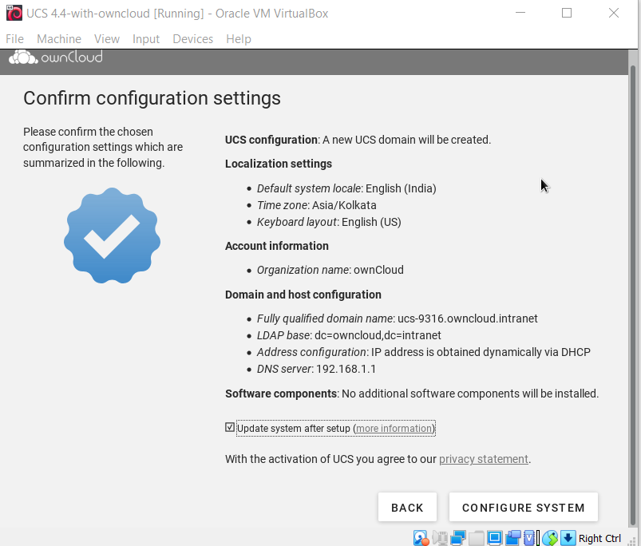

# Getting Started Guide - ownCloud Server
## Introduction
Welcome to the ownCloud Server Getting Started Guide. This guide describes administration tasks for ownCloud, the flexible open source file synchronization and sharing solution.  ownCloud includes the ownCloud server, which runs on Linux, client applications for Microsoft Windows, Mac OS X and Linux, and mobile clients for the Android and
Apple iOS operating systems.


## Audience
This guide is for users who want to install ownCloud servers. 

## Prerequisite
- RAM : 512 MB
- Virtulization software: VirtualBox
- Operating system: Windows, macOS, Linux and Solaris


# Getting Started
To start with ownCloud server you need to [download](https://owncloud.com/download-server/) the package in ZIP or TAR format. 

In order to run the ownCloud server package you require virtualization software. 
Download [Virtual Box](https://owncloud.com/download-server/).


## Import Appliance file
Once you have downloaded the appliance file, import it into your virtualization software, accept the Terms and Conditions of the license agreement, and launch it. 

Follow the below steps to import the appliance file:

1. Click **Import**.


2. Select the .ova file you just downloaded containing the ownCloud appliance.Then click **'Next'** button.


3. In the next screen, check the settings and click **'Import'**.


If you try to install an ownCloud appliance in your domain after removing an existing one, please remember to remove the original one from you DNS configuration. 


## Configuration wizard
Once imported, start the appliance. This will launch the installer wizard which helps you specify the core configuration. This guide is used to securely and easily configure your appliance:


Choose your language: Currently there are two options, English and German. You can set your city, which will then automatically set the localization settings in the next screen.


Set your default language, time zone and keyboard layout. This will be set automatically if you enter your City in the previous screen.

### Domain Setup
Here, you will see the automatically obtained network configuration if you have a DHCP server in your network. If not – you will have to set this yourself. You can also enter an alternate DNS server if you need one.


Domain setup screen below is an important setting.


Select option **'Manage users and permissions on this system'**

### Account creation

In the next screen, enter the name of your organization, your email address and set a password. Be sure to write down or remember the password, it is the root password for your appliance. Make sure you use a real, working email address you can access for it is used to activate the Univention Corporate Server so you have access to the Univention App Center.


Below screen is the default host settings:


You get a finalized confirmation screen of what you have entered / set, and you can finish the process. Note that if you let the check box to update your system in – the installation will take considerably longer. Keep this in mind. You can apply the updates later on if you choose to skip it during the installation.




When the installation is complete, you will see this screen informing you that the installation was successful.


The virtual machine will show you this screen, showing the IP address you have to navigate to in order to activate your appliance.


# API Documentation
## Surfreport
Contains information about surfing conditions, including the surf height, water temperature, wind, and tide. Also provides an overall recommendation about whether to go surfing.


### Endpoints
**surfreport/{beachId}** 

### HTTP method
GET

### Parameters
#### Path parameters

| Path parameter | Required/Optional | Description | Data Type |
| --------- | ----------- | --------- | --------- |
| {beachId} | Optional | Refers to the ID for the beach you want to look up | integer |

#### Query String paramerts

| Query string parameter | Required/Optional | Description | Data Type |
| --------- | ----------- | --------- | --------- |
| days | Optional | The number of days to include in the response. Default is 3. Max 10 | integer |
| time | Optional | The time you want the report for. | Integer. Unix format (ms since 1970) in UTC |

### Sample request

```curl
curl -I -X GET "https://api.openweathermap.org/data/2.5/surfreport?zip=95050&appid=APIKEY&days=1"
```

*Note* - (In the above code, replace `APIKEY` with your actual API key.)

### sample response

The following is a sample response from the surfreport/{beachId} endpoint:

```curl
{
    "surfreport": [
        {
            "beach": "Santa Cruz",
            "monday": {
                "1pm": {
                    "tide": 5,
                    "wind": 15,
                    "watertemp": 80,
                    "surf_height": 5,
					“riptide”:  “moderate”,
                    "recommendation": "Carve it up, brah! The waves are crankin’ wild out there."
                },
                "2pm": {
                    "tide": -1,
                    "wind": 1,
                    "watertemp": 50,
                    "surf_height": 3,
					“riptide”: "extreme"
					"recommendation": "Waves are foam and frothy but rideable in places. Gravitate to the impact zone, due, and hang loose."
                },
                "3pm": {
                    "tide": -1,
                    "wind": 10,
                    "watertemp": 65,
                    "surf_height": 1,
					"riptide": "moderate",
                    "recommendation": "Scene is blown out. Bail inland and chill on the beach instead or you’ll be the one who’ll be shredded, due."
                }
                ...
            }
        }
    ]
}
```
#### Response definitions

The following table describes each item in the response.

| Response Item | Description | Data Type |
| --------- | ----------- | --------- |
| beach | The beach you selected based on the beach ID in the request. The beach name is the official name as described in the National Park Service Geodatabase. | integer |
| {day} | The day(s) of the week requested. | Object |
| {time} | The time for the conditions. | String |
| {day}/{time}/tide | The level of tide at the beach for a specific day and time. Tide is the distance inland that the water rises to, and can be a positive or negative number. When the tide is out, the number is negative. When the tide is in, the number is positive. The 0 point reflects the line when the tide is neither going in nor out but is in transition between the two states. | String |
| {day}/{time}/wind | The wind speed at the beach, measured in knots (nautical miles per hour). Wind affects the surf height and general wave conditions. Wind speeds of more than 15 knots make surf conditions undesirable because the wind creates white caps and choppy waters. | Integer |
| {day}/{time}/watertemp | The temperature of the water, returned in Fahrenheit or Celsius depending upon the units you specify. Water temperatures below 70 F usually require you to wear a wetsuit. With temperatures below 60, you will need at least a 3mm wetsuit and preferably booties to stay warm. | Integer |
| {day}/{time}/surfheight | The height of the waves, returned in either feet or centimeters depending on the units you specify. A surf height of 3 feet is the minimum size needed for surfing. If the surf height exceeds 10 feet, it is not safe to surf. | Integer |
| {day}/{time}/recommendation | An overall recommendation based on a combination of the various factors (wind, watertemp, surfheight), etc. | String |


